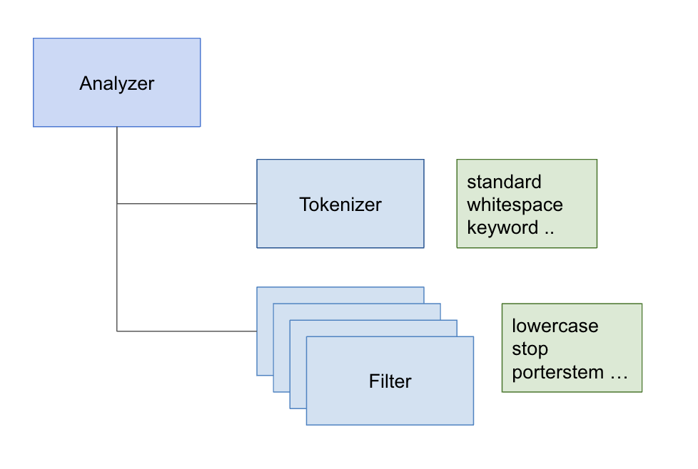
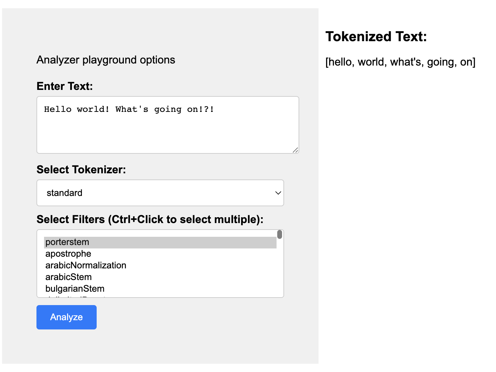

### Term-based search with Astra

#### Quickstart

```
mvn package
mvn spring-boot:run
```

Access the app at `http://localhost:8080`

#### What is it? 
Datastax Astra recently added support for `term` based search for `text` columns!

Now, one can index `text` columns using [SAI](https://docs.datastax.com/en/cql/astra/docs/developing/indexing/sai/sai-concepts.html) with Lucene based [Analyzers](https://lucene.apache.org/core/8_0_0/core/org/apache/lucene/analysis/Analyzer.html) 

for example,
```
CREATE TABLE test.table1 (id text PRIMARY KEY, val text);

CREATE CUSTOM INDEX ON test.table1(val) USING 'org.apache.cassandra.index.sai.StorageAttachedIndex' WITH OPTIONS = { 'index_analyzer': 'standard'};
```

The above index allows to query based on `term(s)` in the text column `val`

for example, 
```
SELECT * FROM test.table1 WHERE val : 'hello';
```
There are several [built-in Analyzers](https://github.com/apache/lucene/tree/main/lucene/analysis/common/src/java/org/apache/lucene/analysis) available

Goal of this project is to help with understanding how Analyzers work, so one can understand how the text columns are indexed and queried.

At a high level, Analyzer has a Tokenizer (to split the text into tokens) and a list of Filters (to apply any required transformation on the tokens)



When run, this project allows users to choose a Token and a list of Filters and see the effect of Analyzer on the given text,

for example,



Have fun!